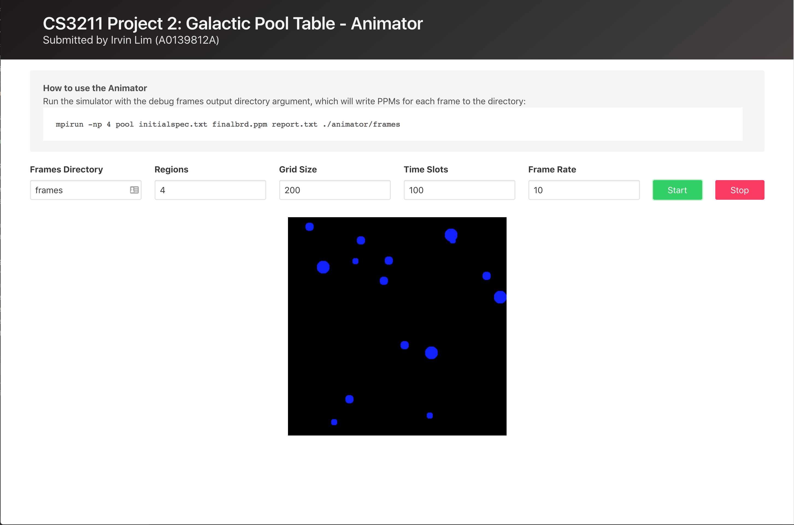

# CS3211 Project 2

_Submitted by Irvin Lim Wei Quan (A0139812A)._

This is a submission for CS3211 Parallel and Concurrent Programming, Project 2 (_Alternate Physics: The Galactic Pool Table_).

The complete project report can also be found in the root directory.

## Installation

This project uses OpenMPI, and is known to work on at least version 3.0.1. You can download the OpenMPI library from [here](https://www.open-mpi.org/software/ompi/v3.0/).

To build the program, a Makefile is included. Run `make` as such:

```sh
make clean
make
```

## Usage

You can then run the program by calling the binary executable with `mpirun`, where `initialspec.txt` is a path to the specification file, and `finalbrd.ppm` is the path of the output PPM image file:

```sh
mpirun -np 64 pool initialspec.txt finalbrd.ppm
```

See `initialspec-example.txt` for an example of how the specification file should look like.

Change the value of the `np` flag to specify the number of regions that should be simulated. For the sequential version, only the master process will be working, while the parallel version will split the work up amongst all processes.

As such, the value of `np` **must be a perfect square**, e.g. 1, 4, 9, 16, 25, etc., since the "pool table" is a square.

### Verbosity

You can increase the verbosity of the output by passing the `LOG_LEVEL` environment variable, according to the following list:

* **0 - NONE**: Suppress all output
* **1 - ERROR**: Only show errors
* **2 - SUCCESS**: Also show success messages
* **3 - NOTICE (Default)**: Also show notices
* **4 - VERBOSE**: Show some verbose messages
* **5 - MPI**: Show verbose messages as well as MPI traces between processes
* **6 - DEBUG**: Debug mode
* **7 - DEBUG2**: Additional debug messages

For example, to increase the verbosity to VERBOSE, you can do

```sh
LOG_LEVEL=4 mpirun -np 64 pool initialspec.txt finalbrd.ppm
```

### Logging for a single process

Because multiple processes may be trying to write to the output buffer (which is `stderr` for this program) at the same time, the log messages will often be interleaved which makes it hard to follow especially on higher log levels.

To help with this, you can limit the logging process to only a certain process so that all log messages are guaranteed to be in order with the `LOG_PROCESS` environment variable, such as follows:

```sh
LOG_LEVEL=6 LOG_PROCESS=0 mpirun -np 4 pool initialspec.txt finalbrd.ppm
```

### Variants

Some variants of the program are included, which are listed below. All of the binaries take in the same command-line arguments as described above.

* `pool`: Parallel version of the galactic pool simulator
* `poolseq`: Sequential version of the galactic pool simulator

## Deployment on NSCC

Since the NSCC server does not have outbound Internet access, deployment and/or sync of the source files over Git is not possible. Instead, you can use `rsync` together with `ssh` to upload the files locally:

```sh
rsync -r -a --exclude=".*/" -e ssh --delete . nscc:~/cs3211-project-2
```

Replace `nscc` with the SSH username + hostname combination, or a SSH hostname alias. Alternatively, the `rsync.sh` file is provided for convenience, which will synchronise the source files to the server, as well as the output/log files back to the local directory.

### Running on NSCC

A sample PBS schedule file can be found at `submit.pbs`. To submit and run the job, you can use the given `qsub.sh` file:

```sh
./qsub.sh
```

## Reports

To save the collated timing report to a file, pass the third argument to `pool`, as follows:

```sh
mpirun -np 64 pool initialspec.txt finalbrd.ppm report.txt
```

## Animator

To help debug as well as to visualise the alternate physics of the galactic pool table, you can write an output PPM file for every single frame by passing the fourth argument to `pool`, as follows:

```sh
mpirun -np 64 pool initialspec.txt finalbrd.ppm report.txt ./animator/frames
```

For a simulation of 100 time slots (as specified through `TimeSlots` in `initialspec.txt`), 100 PPM files will be generated in the `animator/frames` directory, from `0.ppm` to `99.ppm`.

To visualise the simulation as an animation, a simple animator HTML page has been created under `animator/`, using [GPU.js](http://gpu.rocks/):



Since AJAX calls are made, the HTML file (as well as the PPMs) have to be served over HTTP. You can start a simple HTTP server in Python or Node.js, as follows:

For `http.server` (Python 3):

```sh
# Runs a static server on localhost:8000
python -m http.server
```

For `SimpleHTTPServer` (Python 2):

```sh
# Runs a static server on localhost:8000
python -m SimpleHTTPServer
```

Otherwise, for `http-server` (Node.js):

```sh
# Install http-server globally
npm i -g http-server

# Runs a static server on localhost:8080
http-server
```

## License

Copyright, Irvin Lim
